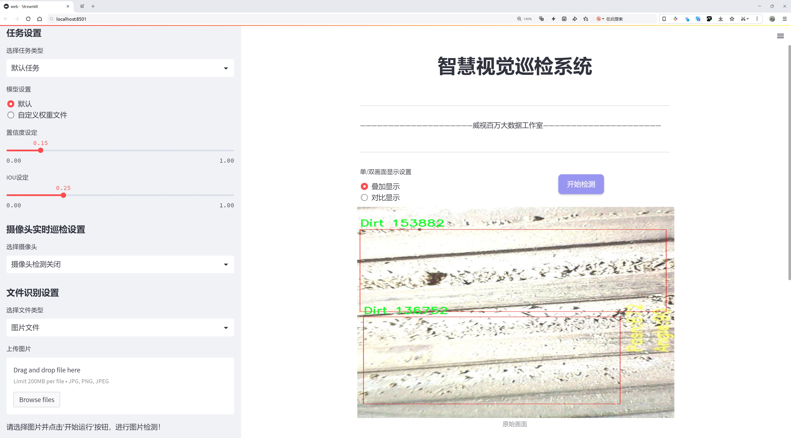
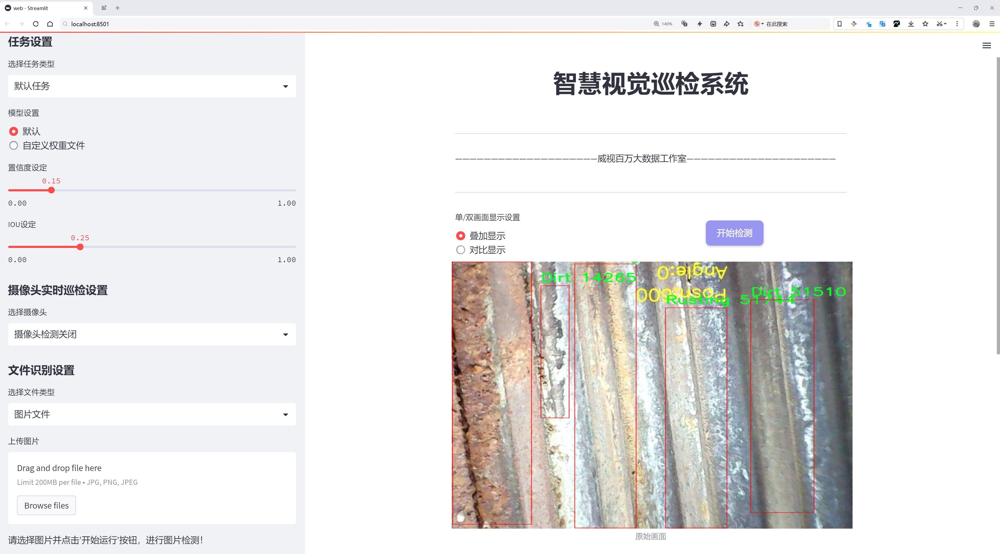
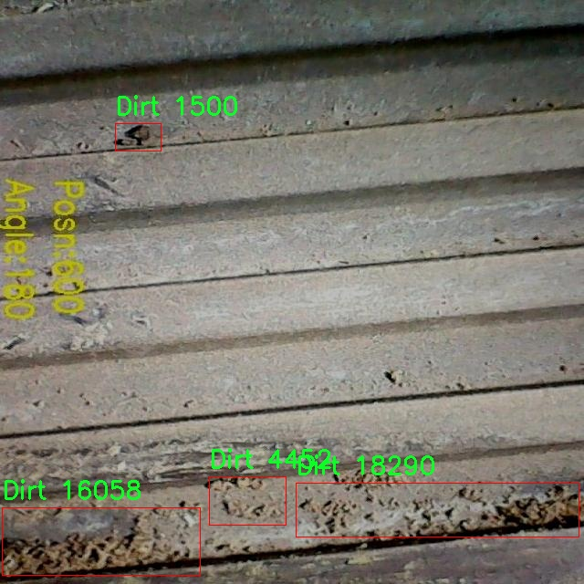
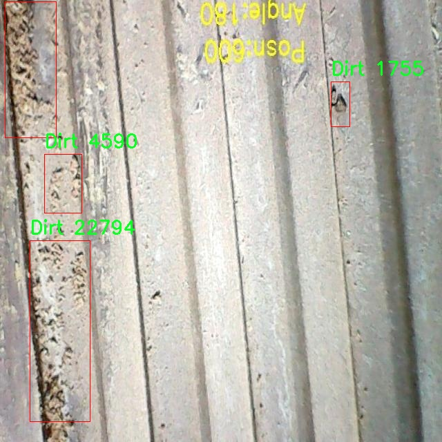
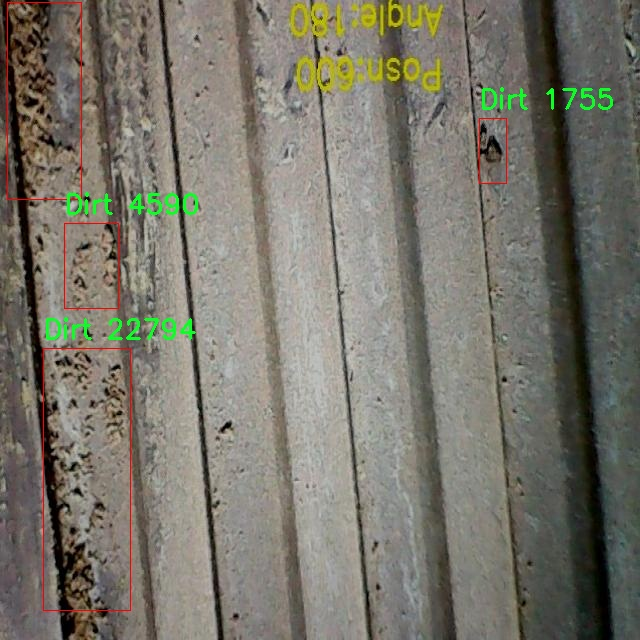
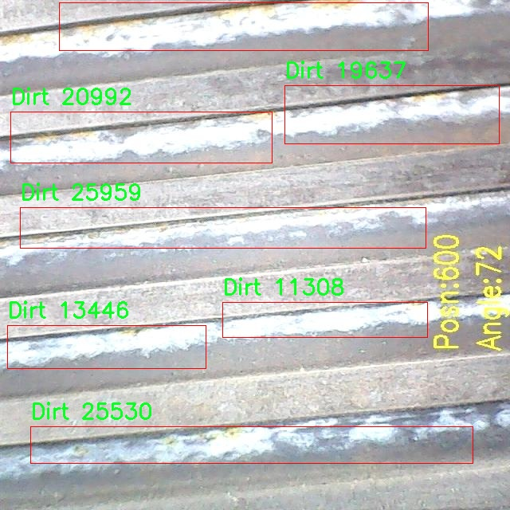
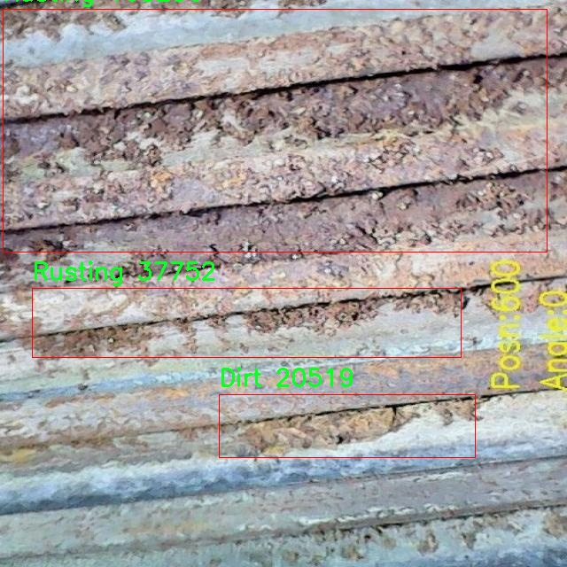

# 表面缺陷检测系统源码分享
 # [一条龙教学YOLOV8标注好的数据集一键训练_70+全套改进创新点发刊_Web前端展示]

### 1.研究背景与意义

项目参考[AAAI Association for the Advancement of Artificial Intelligence](https://gitee.com/qunmasj/projects)

项目来源[AACV Association for the Advancement of Computer Vision](https://kdocs.cn/l/cszuIiCKVNis)

研究背景与意义

随着工业自动化和智能制造的迅速发展，表面缺陷检测在生产质量控制中扮演着越来越重要的角色。传统的人工检测方法不仅效率低下，而且容易受到人为因素的影响，导致检测结果的不稳定性和不准确性。因此，开发高效、准确的自动化表面缺陷检测系统成为了行业内亟待解决的问题。近年来，深度学习技术的快速发展为计算机视觉领域带来了革命性的变化，尤其是目标检测算法的进步，使得机器能够以更高的精度和速度识别和分类图像中的缺陷。

YOLO（You Only Look Once）系列算法作为一种高效的目标检测模型，以其快速的检测速度和较高的准确率受到广泛关注。YOLOv8作为该系列的最新版本，进一步提升了模型的性能和适用性。然而，尽管YOLOv8在多种应用场景中表现出色，但在特定领域的表面缺陷检测中，仍然存在一些挑战。例如，表面缺陷的多样性和复杂性使得模型在不同类型缺陷的识别上可能出现偏差。因此，针对表面缺陷检测任务对YOLOv8进行改进和优化，具有重要的研究意义。

本研究基于改进YOLOv8的表面缺陷检测系统，旨在通过引入特定的训练数据集，提升模型在表面缺陷检测中的性能。所使用的数据集包含4100张图像，涵盖了五种主要的缺陷类别：剥落（Chipping）、污垢（Dirt）、凹坑（Pitting）、锈蚀（Rusting）和热裂纹（Thermal Cracking）。这些缺陷类型在工业生产中普遍存在，直接影响产品的质量和使用寿命。因此，准确识别和分类这些缺陷对于提高产品质量、降低生产成本、提升客户满意度具有重要意义。

在数据集的构建过程中，充分考虑了不同缺陷的特征和表现形式，确保模型能够在多样化的场景中进行有效学习。通过对YOLOv8的网络结构进行改进，结合迁移学习和数据增强等技术，旨在提高模型对小样本缺陷的识别能力和对复杂背景的适应性。此外，研究还将探讨模型在实时检测中的应用潜力，以满足工业生产线对快速、准确检测的需求。

综上所述，基于改进YOLOv8的表面缺陷检测系统的研究，不仅具有重要的理论价值，还对实际生产具有深远的应用意义。通过提升表面缺陷检测的自动化水平，能够有效降低人工成本，提高生产效率，为智能制造的发展提供有力支持。同时，该研究也为后续相关领域的研究提供了新的思路和方法，推动了计算机视觉技术在工业应用中的进一步发展。

### 2.图片演示






##### 注意：由于此博客编辑较早，上面“2.图片演示”和“3.视频演示”展示的系统图片或者视频可能为老版本，新版本在老版本的基础上升级如下：（实际效果以升级的新版本为准）

  （1）适配了YOLOV8的“目标检测”模型和“实例分割”模型，通过加载相应的权重（.pt）文件即可自适应加载模型。

  （2）支持“图片识别”、“视频识别”、“摄像头实时识别”三种识别模式。

  （3）支持“图片识别”、“视频识别”、“摄像头实时识别”三种识别结果保存导出，解决手动导出（容易卡顿出现爆内存）存在的问题，识别完自动保存结果并导出到tempDir中。

  （4）支持Web前端系统中的标题、背景图等自定义修改，后面提供修改教程。

  另外本项目提供训练的数据集和训练教程,暂不提供权重文件（best.pt）,需要您按照教程进行训练后实现图片演示和Web前端界面演示的效果。

### 3.视频演示

[3.1 视频演示](https://www.bilibili.com/video/BV1ZZ12YUEw6/)

### 4.数据集信息展示

##### 4.1 本项目数据集详细数据（类别数＆类别名）

nc: 5
names: ['Chipping', 'Dirt', 'Pitting', 'Rusting', 'ThermalCracking']


##### 4.2 本项目数据集信息介绍

数据集信息展示

在现代工业生产中，表面缺陷的检测是确保产品质量和延长使用寿命的重要环节。为了提升表面缺陷检测系统的准确性和效率，研究者们不断探索和改进现有的检测算法。为此，本研究采用了名为“brightness”的数据集，旨在训练和优化YOLOv8模型，以实现更为精准的表面缺陷检测。

“brightness”数据集专注于五种主要的表面缺陷类型，分别为：Chipping（剥落）、Dirt（污垢）、Pitting（凹坑）、Rusting（生锈）和ThermalCracking（热裂纹）。这些缺陷在不同的工业应用中可能会导致严重的后果，因此，准确识别和分类这些缺陷至关重要。数据集中包含的每一种缺陷类型都经过精心标注，确保模型在训练过程中能够获得高质量的学习样本。

Chipping是指材料表面由于机械冲击或磨损而产生的剥落现象，通常出现在金属或涂层表面。该缺陷不仅影响外观，还可能导致结构强度的下降，因此在检测时需要特别关注。Dirt则是指表面附着的污垢或杂质，这种缺陷虽然在某些情况下不影响材料的性能，但在高标准的产品中仍需被识别并清除。Pitting是一种局部腐蚀现象，通常发生在金属表面，形成小凹坑，可能会影响材料的耐用性和美观。Rusting则是金属氧化的结果，导致表面出现锈斑，这不仅影响产品的外观，还可能导致结构性损害。最后，ThermalCracking是由于温度变化引起的材料裂纹，常见于塑料和金属材料中，这种缺陷的出现往往预示着材料的失效。

在构建“brightness”数据集时，研究团队收集了大量的高质量图像，确保每种缺陷类型都有足够的样本进行训练。这些图像不仅涵盖了不同的拍摄角度和光照条件，还考虑了各种材料和表面处理工艺，以增强模型的泛化能力。此外，数据集中的每一张图像都附有详细的标注信息，包括缺陷的类别、位置及其严重程度，这为后续的模型训练提供了丰富的上下文信息。

通过对“brightness”数据集的深入分析，研究者们能够更好地理解不同表面缺陷的特征和表现形式，从而为YOLOv8模型的训练提供有力支持。该数据集的多样性和丰富性将有助于提高模型在实际应用中的检测准确率，使其能够在复杂的工业环境中快速、准确地识别出各种表面缺陷。

总之，“brightness”数据集不仅为YOLOv8模型的训练提供了坚实的基础，也为表面缺陷检测技术的进一步发展奠定了重要的理论和实践基础。随着研究的深入，期待该数据集能够推动表面缺陷检测领域的创新与进步，为工业生产的质量控制提供更为有效的解决方案。











### 5.全套项目环境部署视频教程（零基础手把手教学）

[5.1 环境部署教程链接（零基础手把手教学）](https://www.ixigua.com/7404473917358506534?logTag=c807d0cbc21c0ef59de5)


[5.2 安装Python虚拟环境创建和依赖库安装视频教程链接（零基础手把手教学）](https://www.ixigua.com/7404474678003106304?logTag=1f1041108cd1f708b01a)

### 6.手把手YOLOV8训练视频教程（零基础小白有手就能学会）

[6.1 手把手YOLOV8训练视频教程（零基础小白有手就能学会）](https://www.ixigua.com/7404477157818401292?logTag=d31a2dfd1983c9668658)


按照上面的训练视频教程链接加载项目提供的数据集，运行train.py即可开始训练



     Epoch   gpu_mem       box       obj       cls    labels  img_size
     1/200     20.8G   0.01576   0.01955  0.007536        22      1280: 100%|██████████| 849/849 [14:42<00:00,  1.04s/it]
               Class     Images     Labels          P          R     mAP@.5 mAP@.5:.95: 100%|██████████| 213/213 [01:14<00:00,  2.87it/s]
                 all       3395      17314      0.994      0.957      0.0957      0.0843

     Epoch   gpu_mem       box       obj       cls    labels  img_size
     2/200     20.8G   0.01578   0.01923  0.007006        22      1280: 100%|██████████| 849/849 [14:44<00:00,  1.04s/it]
               Class     Images     Labels          P          R     mAP@.5 mAP@.5:.95: 100%|██████████| 213/213 [01:12<00:00,  2.95it/s]
                 all       3395      17314      0.996      0.956      0.0957      0.0845

     Epoch   gpu_mem       box       obj       cls    labels  img_size
     3/200     20.8G   0.01561    0.0191  0.006895        27      1280: 100%|██████████| 849/849 [10:56<00:00,  1.29it/s]
               Class     Images     Labels          P          R     mAP@.5 mAP@.5:.95: 100%|███████   | 187/213 [00:52<00:00,  4.04it/s]
                 all       3395      17314      0.996      0.957      0.0957      0.0845


### 7.70+种全套YOLOV8创新点代码加载调参视频教程（一键加载写好的改进模型的配置文件）

[7.1 70+种全套YOLOV8创新点代码加载调参视频教程（一键加载写好的改进模型的配置文件）](https://www.ixigua.com/7404478314661806627?logTag=29066f8288e3f4eea3a4)

### 8.70+种全套YOLOV8创新点原理讲解（非科班也可以轻松写刊发刊，V10版本正在科研待更新）

#### 由于篇幅限制，每个创新点的具体原理讲解就不一一展开，具体见下列网址中的创新点对应子项目的技术原理博客网址【Blog】：


[8.1 70+种全套YOLOV8创新点原理讲解链接](https://gitee.com/qunmasj/good)

#### 部分改进原理讲解(完整的改进原理见上图和技术博客链接)
### YOLOv8简介
#### Yolov8网络模型
Yolov8n的网络分为输入端、主干网( Back-bone) 、Neck模块和输出端4个部分（图4)。输
人端主要有马赛克( Mosaic）数据增强、自适应锚框计算和自适应灰度填充。主干网有Conv、C2和SPPF结构，其中，C2r模块是对残差特征进行学习的主要模块，该模块仿照Yolov7的ELAN结构,通过更多的分支跨层连接，丰富了模型的梯度流，可形成一个具有更强特征表示能力的神经网络模
块。Neck模块采用PAN ( path aggregation nelwOrk ,结构，可加强网络对不同缩放尺度对象特征融合的
能力。输出端将分类和检测过程进行解耦，主要包括损失计算和目标检测框筛选，其中，损失计算过程主要包括正负样本分配策略和 Loss计算，Yolov8n 网络主要使用TaskAlignedAssignerl 10]方法，即根据分类与回归的分数加权结果选择正样本;Loss计算包括分类和回归2个分支，无Ob-jecIness分支。分类分支依然采用BCE Loss，回归分支则使用了Distribution Focal Loss!11〕和CIOU( complele inlersection over union)损失函数。

### 可扩张残差（DWR）注意力模块
当前的许多工作直接采用多速率深度扩张卷积从一个输入特征图中同时捕获多尺度上下文信息，从而提高实时语义分割的特征提取效率。 然而，这种设计可能会因为结构和超参数的不合理而导致多尺度上下文信息的访问困难。 为了降低绘制多尺度上下文信息的难度，我们提出了一种高效的多尺度特征提取方法，该方法分解了原始的单步特征提取方法方法分为两个步骤，区域残差-语义残差。 在该方法中，多速率深度扩张卷积在特征提取中发挥更简单的作用：根据第一步提供的每个简明区域形式特征图，在第二步中使用一个所需的感受野执行简单的基于语义的形态过滤 一步，提高他们的效率。 此外，扩张率和扩张卷积的容量每个网络阶段都经过精心设计，以充分利用所有可以实现的区域形式的特征图。 因此，我们分别为高层和低层网络设计了一种新颖的扩张式残差（DWR）模块和简单倒置残差（SIR）模块。


首先，该博客引入了一个Dilation-wise Residual（DWR）模块，用于提取网络高层的特征，如图2a所示。多分支结构用于扩展感受野，其中每个分支采用不同空洞率的空洞深度卷积。
然后，专门设计了一个Simple Inverted Residual（SIR）模块来提取网络低层的特征，如图2b所示。该模块仅具有3×3的微小感受野，但使用inverted bottleneck式结构来扩展通道数量，确保更强的特征提取能力。
最后，基于DWR和SIR模块，构建了一个编码器-解码器风格的网络DWRSeg，其中解码器采用了简单的类似FCN的结构。解码器使用来自最后两个阶段的强语义信息直接对特征图进行上采样，然后将它们与来自较低阶段的特征图（包含丰富的详细信息）拼接起来，以进行最终预测。


### 9.系统功能展示（检测对象为举例，实际内容以本项目数据集为准）

图9.1.系统支持检测结果表格显示

  图9.2.系统支持置信度和IOU阈值手动调节

  图9.3.系统支持自定义加载权重文件best.pt(需要你通过步骤5中训练获得)

  图9.4.系统支持摄像头实时识别

  图9.5.系统支持图片识别

  图9.6.系统支持视频识别

  图9.7.系统支持识别结果文件自动保存

  图9.8.系统支持Excel导出检测结果数据


### 10.原始YOLOV8算法原理

原始YOLOv8算法原理

YOLOv8作为目标检测领域的最新进展，继承并发展了YOLO系列模型的优良传统，展现出更为卓越的性能和灵活性。其架构由输入层、主干网络、颈部网络和头部网络等多个核心组件构成，形成了一个高效且易于扩展的整体结构。该模型的设计旨在解决目标检测中的实时性和准确性问题，使其在多种应用场景中都能发挥出色的性能。

在YOLOv8的工作流程中，首先，输入图像会被缩放至指定的尺寸，以确保其能够适应网络的输入要求。这一过程不仅是为了满足模型的输入格式，同时也为后续的特征提取和处理奠定了基础。接下来，主干网络通过一系列卷积操作对图像进行下采样，以提取出有用的特征信息。每个卷积层都配备了批归一化和SiLUR激活函数，这种设计旨在提高模型的收敛速度和稳定性。批归一化有助于减小内部协变量偏移，而SiLUR激活函数则通过引入非线性特性，增强了模型对复杂特征的表达能力。

在主干网络中，C2f块的引入是YOLOv8的一大创新。这一模块借鉴了YOLOv7中的E-ELAN结构，通过跨层分支连接来增强模型的梯度流动性，从而改善检测结果。C2f块的设计使得不同层次的特征能够更好地进行融合，提升了模型对目标的识别能力。此外，主干网络末尾的SPPFl块通过三个最大池化层处理多尺度特征，进一步增强了网络的特征抽象能力，使得模型在面对不同大小的目标时，依然能够保持良好的检测性能。

在特征提取完成后，YOLOv8的颈部网络利用特征金字塔网络（FPNS）和路径聚合网络（PAN）结构，旨在融合来自不同尺度的特征图信息。这一过程是至关重要的，因为目标检测往往需要处理多种尺度的物体，颈部网络的设计使得模型能够有效整合不同层次的特征，从而提升整体的检测精度。通过将多层特征进行融合，YOLOv8能够在复杂场景中更好地识别和定位目标。

最终，YOLOv8采用了解耦的检测头设计，具体来说，它通过两个并行的卷积分支分别计算回归和类别的损失。这种解耦设计的优势在于，它允许模型在进行目标定位和分类时，能够独立优化各自的损失函数，从而提升了检测的准确性和效率。相较于传统的耦合检测头，解耦头能够更灵活地处理不同类型的任务，使得YOLOv8在实际应用中表现得更加出色。

YOLOv8在多个方面相较于其前身都有显著的提升。首先，它的推理速度更快，得益于其高效的网络结构和优化的计算流程，使得在实时应用中能够满足更高的要求。其次，YOLOv8在精度上也有了明显的提高，特别是在复杂场景和多目标检测的情况下，模型能够更准确地识别和定位目标。此外，YOLOv8的训练和调整过程变得更加简便，用户可以根据具体需求进行灵活的配置和优化，这为广泛的应用场景提供了便利。

YOLOv8的轻量化版本YOLOv8n则在此基础上进行了进一步的优化。它在骨干特征提取网络层使用了更轻量化的C2F模块，替代了原有的C3模块，减少了计算量，同时保持了特征提取的有效性。在特征融合层，YOLOv8n减少了降采样层的数量，并采用了BiFPN网络以提高对不同尺度特征信息的提取速度。这种双向跨尺度连接和加权特征融合的设计，使得YOLOv8n在轻量化的同时，依然能够保持良好的检测性能。

总的来说，YOLOv8算法通过其创新的网络结构和高效的特征处理方式，成功地提升了目标检测的速度和精度，成为当前业界最为流行和成功的模型之一。其设计理念不仅体现了对前期YOLO模型的继承，更是在此基础上的创新与突破，为目标检测技术的发展提供了新的方向。随着YOLOv8的不断推广和应用，未来的目标检测领域将会迎来更多的可能性和挑战。


### 11.项目核心源码讲解（再也不用担心看不懂代码逻辑）

#### 11.1 70+种YOLOv8算法改进源码大全和调试加载训练教程（非必要）\ultralytics\models\yolo\segment\train.py

以下是对代码的逐文件分析，保留了最核心的部分，并进行了详细的中文注释：

```python
# 引入必要的库和模块
from copy import copy
from ultralytics.models import yolo
from ultralytics.nn.tasks import SegmentationModel
from ultralytics.utils import DEFAULT_CFG, RANK
from ultralytics.utils.plotting import plot_images, plot_results

class SegmentationTrainer(yolo.detect.DetectionTrainer):
    """
    扩展自 DetectionTrainer 类的 SegmentationTrainer 类，用于基于分割模型的训练。

    示例：
        ```python
        from ultralytics.models.yolo.segment import SegmentationTrainer

        args = dict(model='yolov8n-seg.pt', data='coco8-seg.yaml', epochs=3)
        trainer = SegmentationTrainer(overrides=args)
        trainer.train()
        ```
    """

    def __init__(self, cfg=DEFAULT_CFG, overrides=None, _callbacks=None):
        """初始化 SegmentationTrainer 对象，使用给定的参数。"""
        if overrides is None:
            overrides = {}
        overrides['task'] = 'segment'  # 设置任务类型为分割
        super().__init__(cfg, overrides, _callbacks)  # 调用父类构造函数

    def get_model(self, cfg=None, weights=None, verbose=True):
        """返回使用指定配置和权重初始化的 SegmentationModel。"""
        # 创建 SegmentationModel 实例，设置输入通道数为3，类别数为数据集中类别数
        model = SegmentationModel(cfg, ch=3, nc=self.data['nc'], verbose=verbose and RANK == -1)
        if weights:
            model.load(weights)  # 如果提供了权重，则加载权重

        return model  # 返回模型实例

    def get_validator(self):
        """返回用于验证 YOLO 模型的 SegmentationValidator 实例。"""
        self.loss_names = 'box_loss', 'seg_loss', 'cls_loss', 'dfl_loss'  # 定义损失名称
        # 创建并返回 SegmentationValidator 实例
        return yolo.segment.SegmentationValidator(self.test_loader, save_dir=self.save_dir, args=copy(self.args))

    def plot_training_samples(self, batch, ni):
        """创建训练样本图像的绘图，包含标签和边框坐标。"""
        plot_images(batch['img'],  # 训练图像
                    batch['batch_idx'],  # 批次索引
                    batch['cls'].squeeze(-1),  # 类别标签
                    batch['bboxes'],  # 边框坐标
                    batch['masks'],  # 分割掩码
                    paths=batch['im_file'],  # 图像文件路径
                    fname=self.save_dir / f'train_batch{ni}.jpg',  # 保存路径
                    on_plot=self.on_plot)  # 绘图回调

    def plot_metrics(self):
        """绘制训练/验证指标。"""
        plot_results(file=self.csv, segment=True, on_plot=self.on_plot)  # 保存结果图像
```

### 代码核心部分说明：
1. **类 SegmentationTrainer**：这是一个用于训练分割模型的类，继承自 YOLO 的检测训练器。
2. **初始化方法**：在初始化时设置任务类型为分割，并调用父类的初始化方法。
3. **获取模型**：`get_model` 方法用于创建和返回一个分割模型实例，并可以加载预训练权重。
4. **获取验证器**：`get_validator` 方法返回一个用于验证模型性能的验证器实例，并定义了损失名称。
5. **绘制训练样本**：`plot_training_samples` 方法用于可视化训练样本，包括图像、类别、边框和分割掩码。
6. **绘制指标**：`plot_metrics` 方法用于绘制训练和验证过程中的指标，便于分析模型性能。

这些核心部分和注释提供了对代码功能的清晰理解，便于后续的使用和扩展。

这个文件是Ultralytics YOLOv8模型中用于图像分割任务的训练代码，主要定义了一个名为`SegmentationTrainer`的类，该类继承自`DetectionTrainer`，用于处理分割模型的训练过程。

在类的构造函数`__init__`中，首先初始化了一个分割训练器对象。它接受一些参数，包括配置文件`cfg`、覆盖参数`overrides`和回调函数`_callbacks`。如果没有提供覆盖参数，默认将其设置为空字典。接着，将任务类型设置为“segment”，并调用父类的构造函数进行初始化。

`get_model`方法用于返回一个初始化的分割模型`SegmentationModel`，该模型根据传入的配置和权重进行初始化。如果提供了权重文件，则会加载这些权重。该方法的参数包括配置`cfg`、权重`weights`和一个用于控制输出详细信息的`verbose`标志。

`get_validator`方法返回一个`SegmentationValidator`实例，用于验证YOLO模型的性能。在这个方法中，定义了损失名称，包括边界框损失、分割损失、分类损失和深度学习损失。返回的验证器会使用测试数据加载器和保存目录进行初始化。

`plot_training_samples`方法用于绘制训练样本的图像，包括标签和边界框坐标。它接收一个批次的训练数据和批次索引`ni`，并使用`plot_images`函数生成包含图像、索引、类别、边界框和掩码的可视化图像，并将其保存到指定的目录中。

最后，`plot_metrics`方法用于绘制训练和验证过程中的指标。它调用`plot_results`函数，将训练结果保存为图像文件，并支持在绘图时进行显示。

总体而言，这个文件提供了一个结构化的方式来训练YOLOv8的分割模型，包含了模型初始化、验证、训练样本可视化和结果绘制等功能，适合于进行图像分割任务的开发和调试。

#### 11.2 ui.py

以下是经过简化并添加详细中文注释的核心代码部分：

```python
import sys
import subprocess

def run_script(script_path):
    """
    使用当前 Python 环境运行指定的脚本。

    参数:
        script_path (str): 要运行的脚本路径

    返回:
        None
    """
    # 获取当前 Python 解释器的路径
    python_path = sys.executable

    # 构建运行命令，使用 streamlit 运行指定的脚本
    command = f'"{python_path}" -m streamlit run "{script_path}"'

    # 执行命令，并等待其完成
    result = subprocess.run(command, shell=True)
    
    # 检查命令执行结果，如果返回码不为0，表示出错
    if result.returncode != 0:
        print("脚本运行出错。")

# 如果该脚本是主程序，则执行以下代码
if __name__ == "__main__":
    # 指定要运行的脚本路径
    script_path = "web.py"  # 这里可以替换为实际的脚本路径

    # 调用函数运行指定的脚本
    run_script(script_path)
```

### 代码说明：
1. **导入模块**：
   - `sys`：用于获取当前 Python 解释器的路径。
   - `subprocess`：用于执行外部命令。

2. **`run_script` 函数**：
   - 接受一个参数 `script_path`，表示要运行的脚本路径。
   - 使用 `sys.executable` 获取当前 Python 解释器的路径。
   - 构建一个命令字符串，使用 `streamlit` 模块运行指定的脚本。
   - 使用 `subprocess.run` 执行命令，并等待其完成。
   - 检查命令的返回码，如果不为0，打印错误信息。

3. **主程序部分**：
   - 通过 `if __name__ == "__main__":` 确保只有在直接运行该脚本时才会执行以下代码。
   - 指定要运行的脚本路径（这里使用了 `web.py`）。
   - 调用 `run_script` 函数来执行指定的脚本。

这个程序文件名为 `ui.py`，其主要功能是使用当前的 Python 环境来运行一个指定的脚本。程序的第一部分导入了必要的模块，包括 `sys`、`os` 和 `subprocess`，以及一个自定义模块 `QtFusion.path` 中的 `abs_path` 函数。

在 `run_script` 函数中，首先定义了一个参数 `script_path`，它是要运行的脚本的路径。函数内部首先获取当前 Python 解释器的路径，存储在 `python_path` 变量中。接着，构建了一个命令字符串，该命令使用 `streamlit` 模块来运行指定的脚本。命令的格式是将 Python 解释器的路径与 `-m streamlit run` 以及脚本路径结合起来。

然后，使用 `subprocess.run` 方法执行这个命令，`shell=True` 参数允许在 shell 中执行命令。执行后，程序检查返回的结果码，如果结果码不为 0，表示脚本运行出错，程序会打印出相应的错误信息。

在文件的最后部分，使用 `if __name__ == "__main__":` 语句来确保只有在直接运行该脚本时才会执行后面的代码。在这里，首先调用 `abs_path` 函数来获取 `web.py` 脚本的绝对路径，并将其赋值给 `script_path` 变量。最后，调用 `run_script` 函数来运行这个脚本。

整体来看，这个程序的主要目的是为了方便地在当前 Python 环境中运行一个名为 `web.py` 的脚本，并处理可能出现的错误。

#### 11.3 70+种YOLOv8算法改进源码大全和调试加载训练教程（非必要）\ultralytics\trackers\bot_sort.py

以下是代码中最核心的部分，并附上详细的中文注释：

```python
class BOTrack(STrack):
    """
    BOTrack类是YOLOv8的STrack类的扩展版本，增加了物体跟踪的功能。
    """

    shared_kalman = KalmanFilterXYWH()  # 所有BOTrack实例共享的卡尔曼滤波器

    def __init__(self, tlwh, score, cls, feat=None, feat_history=50):
        """初始化BOTrack实例，设置边界框、得分、类别和特征历史长度。"""
        super().__init__(tlwh, score, cls)  # 调用父类的初始化方法

        self.smooth_feat = None  # 平滑特征向量
        self.curr_feat = None  # 当前特征向量
        if feat is not None:
            self.update_features(feat)  # 如果提供特征，则更新特征
        self.features = deque([], maxlen=feat_history)  # 存储特征向量的双端队列，最大长度为feat_history
        self.alpha = 0.9  # 指数移动平均的平滑因子

    def update_features(self, feat):
        """更新特征向量，并使用指数移动平均进行平滑处理。"""
        feat /= np.linalg.norm(feat)  # 归一化特征向量
        self.curr_feat = feat  # 更新当前特征
        if self.smooth_feat is None:
            self.smooth_feat = feat  # 如果平滑特征为空，则直接赋值
        else:
            # 使用指数移动平均更新平滑特征
            self.smooth_feat = self.alpha * self.smooth_feat + (1 - self.alpha) * feat
        self.features.append(feat)  # 将特征添加到队列中
        self.smooth_feat /= np.linalg.norm(self.smooth_feat)  # 归一化平滑特征

    def predict(self):
        """使用卡尔曼滤波器预测均值和协方差。"""
        mean_state = self.mean.copy()  # 复制当前均值状态
        if self.state != TrackState.Tracked:
            mean_state[6] = 0  # 如果状态不是跟踪状态，则将速度设置为0
            mean_state[7] = 0

        # 使用卡尔曼滤波器进行预测
        self.mean, self.covariance = self.kalman_filter.predict(mean_state, self.covariance)

    @property
    def tlwh(self):
        """获取当前边界框位置，格式为(左上角x, 左上角y, 宽度, 高度)。"""
        if self.mean is None:
            return self._tlwh.copy()  # 如果均值为空，返回初始边界框
        ret = self.mean[:4].copy()  # 复制均值的前四个元素
        ret[:2] -= ret[2:] / 2  # 计算左上角坐标
        return ret  # 返回计算后的边界框

class BOTSORT(BYTETracker):
    """
    BOTSORT类是BYTETracker类的扩展版本，设计用于YOLOv8的物体跟踪，支持ReID和GMC算法。
    """

    def __init__(self, args, frame_rate=30):
        """初始化BOTSORT实例，设置ReID模块和GMC算法。"""
        super().__init__(args, frame_rate)  # 调用父类的初始化方法
        self.proximity_thresh = args.proximity_thresh  # 空间接近阈值
        self.appearance_thresh = args.appearance_thresh  # 外观相似性阈值

        if args.with_reid:
            self.encoder = None  # 如果启用ReID，则初始化编码器
        self.gmc = GMC(method=args.gmc_method)  # 初始化GMC算法

    def init_track(self, dets, scores, cls, img=None):
        """使用检测结果、得分和类别初始化跟踪。"""
        if len(dets) == 0:
            return []  # 如果没有检测结果，返回空列表
        if self.args.with_reid and self.encoder is not None:
            features_keep = self.encoder.inference(img, dets)  # 进行ReID特征提取
            return [BOTrack(xyxy, s, c, f) for (xyxy, s, c, f) in zip(dets, scores, cls, features_keep)]  # 返回BOTrack实例
        else:
            return [BOTrack(xyxy, s, c) for (xyxy, s, c) in zip(dets, scores, cls)]  # 返回BOTrack实例

    def multi_predict(self, tracks):
        """使用YOLOv8模型预测和跟踪多个物体。"""
        BOTrack.multi_predict(tracks)  # 调用BOTrack的多目标预测方法
```

### 代码核心部分解释：
1. **BOTrack类**：这是YOLOv8的跟踪类，继承自STrack，主要负责物体的跟踪与特征更新。
   - **shared_kalman**：一个共享的卡尔曼滤波器实例，用于所有BOTrack对象的状态预测。
   - **update_features**：更新特征并进行平滑处理，使用指数移动平均来平滑特征向量。
   - **predict**：使用卡尔曼滤波器预测当前物体的状态。
   - **tlwh属性**：提供当前物体的边界框信息。

2. **BOTSORT类**：这是一个扩展的跟踪器，支持ReID和GMC算法。
   - **init_track**：初始化跟踪器，处理检测结果并提取特征。
   - **multi_predict**：调用BOTrack的多目标预测方法来处理多个物体的跟踪。

这些核心部分是实现YOLOv8物体跟踪的基础，涉及到特征更新、状态预测和多目标跟踪的逻辑。

这个程序文件是关于YOLOv8算法中对象跟踪的实现，主要包含两个类：`BOTrack`和`BOTSORT`。`BOTrack`类是对YOLOv8中`STrack`类的扩展，增加了对象跟踪的功能，而`BOTSORT`类则是对`BYTETracker`类的扩展，设计用于结合ReID（重识别）和GMC（全局运动一致性）算法进行对象跟踪。

在`BOTrack`类中，首先定义了一些属性，包括一个共享的卡尔曼滤波器、平滑特征向量、当前特征向量、特征历史的双端队列、平滑因子和卡尔曼滤波器的均值与协方差矩阵。该类的构造函数初始化了这些属性，并在提供特征时更新特征向量。`update_features`方法使用指数移动平均法来平滑特征向量，并将其存储在队列中。`predict`方法利用卡尔曼滤波器预测对象的状态。`re_activate`和`update`方法用于重新激活和更新跟踪对象的状态，`tlwh`属性返回当前的边界框位置。

`BOTSORT`类则在初始化时设置了一些跟踪参数，包括空间接近阈值和外观相似性阈值，并根据是否启用ReID来决定是否使用特征编码器。`get_kalmanfilter`方法返回一个卡尔曼滤波器实例，`init_track`方法用于初始化跟踪对象，`get_dists`方法计算跟踪对象与检测对象之间的距离，支持IoU和ReID嵌入的结合。`multi_predict`方法则用于对多个对象进行预测和跟踪。

整体而言，这个文件实现了YOLOv8算法中对象跟踪的核心功能，结合了卡尔曼滤波、特征平滑和重识别技术，旨在提高对象跟踪的准确性和鲁棒性。

#### 11.4 train.py

以下是代码中最核心的部分，并附上详细的中文注释：

```python
class DetectionTrainer(BaseTrainer):
    """
    DetectionTrainer类用于基于检测模型进行训练，继承自BaseTrainer类。
    """

    def build_dataset(self, img_path, mode="train", batch=None):
        """
        构建YOLO数据集。

        参数:
            img_path (str): 包含图像的文件夹路径。
            mode (str): 模式，可以是'train'或'val'，用户可以为每种模式自定义不同的数据增强。
            batch (int, optional): 批次大小，仅用于'rect'模式。默认为None。
        """
        gs = max(int(de_parallel(self.model).stride.max() if self.model else 0), 32)
        return build_yolo_dataset(self.args, img_path, batch, self.data, mode=mode, rect=mode == "val", stride=gs)

    def get_dataloader(self, dataset_path, batch_size=16, rank=0, mode="train"):
        """构造并返回数据加载器。"""
        assert mode in ["train", "val"]  # 确保模式为'train'或'val'
        with torch_distributed_zero_first(rank):  # 仅在DDP中初始化数据集*.cache一次
            dataset = self.build_dataset(dataset_path, mode, batch_size)  # 构建数据集
        shuffle = mode == "train"  # 训练模式下打乱数据
        if getattr(dataset, "rect", False) and shuffle:
            LOGGER.warning("WARNING ⚠️ 'rect=True'与DataLoader的shuffle不兼容，设置shuffle=False")
            shuffle = False
        workers = self.args.workers if mode == "train" else self.args.workers * 2  # 设置工作线程数
        return build_dataloader(dataset, batch_size, workers, shuffle, rank)  # 返回数据加载器

    def preprocess_batch(self, batch):
        """对一批图像进行预处理，包括缩放和转换为浮点数。"""
        batch["img"] = batch["img"].to(self.device, non_blocking=True).float() / 255  # 将图像转移到设备并归一化
        if self.args.multi_scale:  # 如果启用多尺度
            imgs = batch["img"]
            sz = (
                random.randrange(self.args.imgsz * 0.5, self.args.imgsz * 1.5 + self.stride)
                // self.stride
                * self.stride
            )  # 随机选择新的尺寸
            sf = sz / max(imgs.shape[2:])  # 计算缩放因子
            if sf != 1:
                ns = [
                    math.ceil(x * sf / self.stride) * self.stride for x in imgs.shape[2:]
                ]  # 计算新的形状
                imgs = nn.functional.interpolate(imgs, size=ns, mode="bilinear", align_corners=False)  # 进行插值
            batch["img"] = imgs  # 更新图像
        return batch

    def set_model_attributes(self):
        """设置模型的属性，包括类别数量和名称。"""
        self.model.nc = self.data["nc"]  # 将类别数量附加到模型
        self.model.names = self.data["names"]  # 将类别名称附加到模型
        self.model.args = self.args  # 将超参数附加到模型

    def get_model(self, cfg=None, weights=None, verbose=True):
        """返回YOLO检测模型。"""
        model = DetectionModel(cfg, nc=self.data["nc"], verbose=verbose and RANK == -1)  # 创建检测模型
        if weights:
            model.load(weights)  # 加载权重
        return model

    def get_validator(self):
        """返回YOLO模型验证器。"""
        self.loss_names = "box_loss", "cls_loss", "dfl_loss"  # 定义损失名称
        return yolo.detect.DetectionValidator(
            self.test_loader, save_dir=self.save_dir, args=copy(self.args), _callbacks=self.callbacks
        )

    def label_loss_items(self, loss_items=None, prefix="train"):
        """
        返回带标签的训练损失项字典。

        对于分类不需要，但对于分割和检测是必要的。
        """
        keys = [f"{prefix}/{x}" for x in self.loss_names]  # 创建损失项的键
        if loss_items is not None:
            loss_items = [round(float(x), 5) for x in loss_items]  # 将张量转换为保留5位小数的浮点数
            return dict(zip(keys, loss_items))  # 返回损失项字典
        else:
            return keys  # 返回键列表

    def plot_training_samples(self, batch, ni):
        """绘制带有注释的训练样本。"""
        plot_images(
            images=batch["img"],
            batch_idx=batch["batch_idx"],
            cls=batch["cls"].squeeze(-1),
            bboxes=batch["bboxes"],
            paths=batch["im_file"],
            fname=self.save_dir / f"train_batch{ni}.jpg",
            on_plot=self.on_plot,
        )

    def plot_metrics(self):
        """从CSV文件中绘制指标。"""
        plot_results(file=self.csv, on_plot=self.on_plot)  # 保存结果图像

    def plot_training_labels(self):
        """创建YOLO模型的标记训练图。"""
        boxes = np.concatenate([lb["bboxes"] for lb in self.train_loader.dataset.labels], 0)  # 合并所有边界框
        cls = np.concatenate([lb["cls"] for lb in self.train_loader.dataset.labels], 0)  # 合并所有类别
        plot_labels(boxes, cls.squeeze(), names=self.data["names"], save_dir=self.save_dir, on_plot=self.on_plot)  # 绘制标签
```

以上代码展示了YOLO检测模型训练的核心逻辑，包括数据集构建、数据加载、批处理预处理、模型属性设置、模型获取、验证器获取、损失项标记、训练样本绘制、指标绘制和训练标签绘制等功能。每个方法都有详细的中文注释，帮助理解其功能和作用。

这个程序文件 `train.py` 是一个用于训练 YOLO（You Only Look Once）目标检测模型的脚本，基于 Ultralytics 提供的框架。程序的核心是 `DetectionTrainer` 类，它继承自 `BaseTrainer` 类，专门用于处理目标检测任务。

在这个类中，首先定义了 `build_dataset` 方法，用于构建 YOLO 数据集。这个方法接收图像路径、模式（训练或验证）和批量大小作为参数。它通过调用 `build_yolo_dataset` 函数来生成数据集，确保在验证模式下使用矩形填充。

接下来，`get_dataloader` 方法用于构建数据加载器。它会根据传入的模式（训练或验证）初始化数据集，并设置是否打乱数据。对于训练模式，数据会被打乱，而在验证模式下则不会。

`preprocess_batch` 方法负责对输入的图像批次进行预处理，包括将图像缩放到合适的大小并转换为浮点数格式。它还支持多尺度训练，通过随机选择图像大小来增强模型的鲁棒性。

`set_model_attributes` 方法用于设置模型的属性，包括类别数量和类别名称。这些信息会被附加到模型中，以便在训练过程中使用。

`get_model` 方法返回一个 YOLO 检测模型实例，并可以加载预训练权重。`get_validator` 方法则返回一个用于模型验证的 `DetectionValidator` 实例，帮助监控模型在验证集上的表现。

在损失计算方面，`label_loss_items` 方法返回一个包含训练损失项的字典，便于后续的监控和记录。`progress_string` 方法则格式化输出训练进度，包括当前的轮次、GPU 内存使用情况、损失值、实例数量和图像大小等信息。

此外，`plot_training_samples` 方法用于绘制训练样本及其标注，帮助可视化训练过程中的数据。`plot_metrics` 和 `plot_training_labels` 方法则分别用于绘制训练过程中的指标和标注图，便于分析模型的训练效果。

总体来说，这个文件提供了一个完整的框架，用于训练 YOLO 模型，包括数据集构建、数据加载、模型初始化、损失计算和可视化等功能，旨在帮助用户高效地进行目标检测任务的训练。

#### 11.5 code\ultralytics\models\utils\__init__.py

```python
# Ultralytics YOLO 🚀, AGPL-3.0 license

# 这段代码是 Ultralytics YOLO 的一部分，YOLO（You Only Look Once）是一种实时目标检测算法。
# 该算法通过将图像划分为网格并在每个网格中预测边界框和类别概率来实现目标检测。

# 下面是一个核心的代码示例，通常包括模型的初始化和推理过程。

class YOLO:
    def __init__(self, model_path):
        # 初始化 YOLO 模型
        # model_path: 模型文件的路径
        self.model = self.load_model(model_path)  # 加载预训练模型

    def load_model(self, model_path):
        # 加载模型的具体实现
        # 这里可以是加载 PyTorch 模型或其他深度学习框架的模型
        pass  # 实际代码中会有加载模型的实现

    def predict(self, image):
        # 对输入图像进行目标检测
        # image: 输入的图像数据
        detections = self.model(image)  # 使用模型进行推理
        return detections  # 返回检测结果

# 使用示例
if __name__ == "__main__":
    yolo = YOLO("path/to/model.pt")  # 实例化 YOLO 模型
    image = "path/to/image.jpg"  # 输入图像路径
    results = yolo.predict(image)  # 进行目标检测
    print(results)  # 输出检测结果
```

### 代码注释说明：
1. **YOLO 类**：这是一个用于实现 YOLO 模型的类，包含模型的加载和推理功能。
2. **`__init__` 方法**：构造函数，用于初始化 YOLO 模型，接收模型文件的路径并调用 `load_model` 方法加载模型。
3. **`load_model` 方法**：负责加载预训练的 YOLO 模型，具体实现会根据使用的深度学习框架而有所不同。
4. **`predict` 方法**：接收输入图像并使用加载的模型进行目标检测，返回检测结果。
5. **使用示例**：在主程序中实例化 YOLO 类，加载模型并对指定图像进行目标检测，最后输出检测结果。

该文件是Ultralytics YOLO项目的一部分，文件名为`__init__.py`，通常用于标识一个目录为Python包。在这个文件中，包含了一些与YOLO（You Only Look Once）模型相关的工具和功能。虽然文件中只有一行注释，内容为“Ultralytics YOLO 🚀, AGPL-3.0 license”，但这行注释表明了该项目的名称、作者以及使用的许可证类型。

“Ultralytics YOLO”是一个流行的目标检测模型，广泛应用于计算机视觉领域。AGPL-3.0许可证是一种开源许可证，允许用户自由使用、修改和分发代码，但要求在分发修改后的代码时也必须以相同的许可证发布。

在实际使用中，`__init__.py`文件通常会包含包的初始化代码，或者用于导入该包中的其他模块和功能。虽然这个文件没有具体的实现代码，但它的存在是为了确保该目录可以作为一个Python包被导入，方便用户在其他代码中使用YOLO模型的相关功能。

#### 11.6 70+种YOLOv8算法改进源码大全和调试加载训练教程（非必要）\ultralytics\utils\callbacks\tensorboard.py

以下是代码中最核心的部分，并附上详细的中文注释：

```python
# 导入必要的库
from ultralytics.utils import LOGGER, SETTINGS, TESTS_RUNNING, colorstr

try:
    # 尝试导入TensorBoard的SummaryWriter，用于记录训练过程中的指标
    from torch.utils.tensorboard import SummaryWriter

    # 确保当前不是在运行测试
    assert not TESTS_RUNNING  
    # 确保TensorBoard集成已启用
    assert SETTINGS['tensorboard'] is True  
    WRITER = None  # 初始化TensorBoard的SummaryWriter实例

except (ImportError, AssertionError, TypeError):
    # 捕获导入错误、断言错误和类型错误
    SummaryWriter = None  # 如果导入失败，则将SummaryWriter设置为None


def _log_scalars(scalars, step=0):
    """将标量值记录到TensorBoard中。"""
    if WRITER:  # 如果WRITER已初始化
        for k, v in scalars.items():  # 遍历标量字典
            WRITER.add_scalar(k, v, step)  # 记录每个标量


def _log_tensorboard_graph(trainer):
    """将模型图记录到TensorBoard中。"""
    try:
        import warnings
        from ultralytics.utils.torch_utils import de_parallel, torch

        imgsz = trainer.args.imgsz  # 获取输入图像的大小
        imgsz = (imgsz, imgsz) if isinstance(imgsz, int) else imgsz  # 确保图像大小为元组
        p = next(trainer.model.parameters())  # 获取模型参数以确定设备和类型
        im = torch.zeros((1, 3, *imgsz), device=p.device, dtype=p.dtype)  # 创建一个全零的输入图像

        with warnings.catch_warnings():
            warnings.simplefilter('ignore', category=UserWarning)  # 忽略JIT追踪警告
            WRITER.add_graph(torch.jit.trace(de_parallel(trainer.model), im, strict=False), [])  # 记录模型图
    except Exception as e:
        LOGGER.warning(f'WARNING ⚠️ TensorBoard图形可视化失败 {e}')  # 记录警告信息


def on_pretrain_routine_start(trainer):
    """初始化TensorBoard记录，使用SummaryWriter。"""
    if SummaryWriter:  # 如果SummaryWriter可用
        try:
            global WRITER
            WRITER = SummaryWriter(str(trainer.save_dir))  # 创建SummaryWriter实例
            prefix = colorstr('TensorBoard: ')
            LOGGER.info(f"{prefix}开始使用 'tensorboard --logdir {trainer.save_dir}'，可在 http://localhost:6006/ 查看。")
        except Exception as e:
            LOGGER.warning(f'WARNING ⚠️ TensorBoard未正确初始化，未记录此次运行。 {e}')  # 记录警告信息


def on_train_start(trainer):
    """记录TensorBoard图形。"""
    if WRITER:  # 如果WRITER已初始化
        _log_tensorboard_graph(trainer)  # 记录模型图


def on_batch_end(trainer):
    """在训练批次结束时记录标量统计信息。"""
    _log_scalars(trainer.label_loss_items(trainer.tloss, prefix='train'), trainer.epoch + 1)  # 记录当前批次的损失


def on_fit_epoch_end(trainer):
    """在训练周期结束时记录周期指标。"""
    _log_scalars(trainer.metrics, trainer.epoch + 1)  # 记录当前周期的指标


# 定义回调函数字典，根据SummaryWriter是否可用来决定是否初始化
callbacks = {
    'on_pretrain_routine_start': on_pretrain_routine_start,
    'on_train_start': on_train_start,
    'on_fit_epoch_end': on_fit_epoch_end,
    'on_batch_end': on_batch_end} if SummaryWriter else {}
```

### 代码说明：
1. **导入部分**：导入必要的库和模块，确保TensorBoard的SummaryWriter可用。
2. **_log_scalars**：记录标量值到TensorBoard，方便后续查看训练过程中的指标变化。
3. **_log_tensorboard_graph**：记录模型的计算图，帮助可视化模型结构。
4. **on_pretrain_routine_start**：在训练开始前初始化TensorBoard的记录器，并输出相关信息。
5. **on_train_start**：在训练开始时记录模型图。
6. **on_batch_end**：在每个训练批次结束时记录损失信息。
7. **on_fit_epoch_end**：在每个训练周期结束时记录指标信息。
8. **callbacks字典**：根据SummaryWriter的可用性定义回调函数，以便在训练过程中调用。

这个程序文件是用于集成TensorBoard的回调函数，主要用于在Ultralytics YOLO模型训练过程中记录和可视化训练的相关数据。首先，文件导入了一些必要的模块，包括日志记录器和TensorBoard的SummaryWriter。通过try-except结构，程序确保在没有安装TensorBoard或在特定条件下（如测试运行时）不会引发错误。

在程序中，定义了几个主要的函数。`_log_scalars`函数用于将标量值记录到TensorBoard，接收一个字典类型的参数`scalars`和一个步数`step`，如果WRITER实例存在，则遍历字典并将每个标量值添加到TensorBoard中。

`_log_tensorboard_graph`函数用于记录模型的计算图。它首先获取输入图像的大小，并创建一个全零的张量作为输入。然后，使用Torch的JIT追踪功能记录模型的计算图，并在过程中抑制一些警告。如果出现异常，程序会记录警告信息。

`on_pretrain_routine_start`函数在训练开始前初始化TensorBoard的记录，创建SummaryWriter实例并记录相关信息。如果初始化失败，会记录警告信息。

`on_train_start`函数在训练开始时调用，用于记录模型的计算图。

`on_batch_end`函数在每个训练批次结束时调用，记录当前批次的标量统计信息。

`on_fit_epoch_end`函数在每个训练周期结束时调用，记录该周期的度量信息。

最后，程序将这些回调函数存储在一个字典中，只有在SummaryWriter存在的情况下才会创建这个字典。这样设计的目的是为了确保在没有TensorBoard支持的情况下，程序不会因为缺少回调而崩溃。整体来看，这个文件的目的是为了增强YOLO模型训练过程中的可视化和监控能力，帮助用户更好地理解和调试模型的训练过程。

### 12.系统整体结构（节选）

### 整体功能和构架概括

该项目是一个基于YOLOv8的目标检测和分割框架，提供了丰富的功能和模块，旨在支持用户进行目标检测模型的训练、验证和推理。项目的核心包括模型的定义、训练过程的管理、数据集的处理、回调函数的集成（如TensorBoard可视化）以及跟踪算法的实现。整体架构设计上，项目模块化程度高，各个功能通过不同的文件和类进行组织，便于扩展和维护。

- **模型训练**：通过`train.py`和`segment/train.py`文件，用户可以方便地训练YOLOv8模型，支持目标检测和分割任务。
- **数据处理**：提供数据集构建和加载功能，确保训练过程中的数据高效流动。
- **回调和可视化**：通过`tensorboard.py`文件集成TensorBoard，记录训练过程中的指标，帮助用户监控模型性能。
- **对象跟踪**：`bot_sort.py`实现了基于YOLOv8的对象跟踪功能，结合了重识别和运动一致性算法。
- **工具和实用功能**：`__init__.py`和其他工具文件提供了基础设施和实用功能，支持项目的整体运行。

### 文件功能整理表

| 文件路径                                                                                     | 功能描述                                                                                      |
|----------------------------------------------------------------------------------------------|-----------------------------------------------------------------------------------------------|
| `ultralytics/models/yolo/segment/train.py`                                                  | 负责YOLOv8分割模型的训练，包括数据集构建、模型初始化、损失计算和可视化等功能。                     |
| `ui.py`                                                                                     | 用于运行指定的脚本，主要是通过Streamlit启动一个Web应用，方便用户进行交互式操作。                 |
| `ultralytics/trackers/bot_sort.py`                                                          | 实现YOLOv8的对象跟踪功能，结合了重识别和全局运动一致性算法，提供了跟踪对象的管理和预测功能。         |
| `train.py`                                                                                  | 负责YOLO目标检测模型的训练，包含数据加载、模型设置、损失计算和训练过程的监控等功能。              |
| `ultralytics/models/utils/__init__.py`                                                     | 标识目录为Python包，通常用于导入该包中的其他模块和功能。                                        |
| `ultralytics/utils/callbacks/tensorboard.py`                                              | 集成TensorBoard的回调函数，用于记录和可视化训练过程中的指标，增强模型训练的可视化能力。            |
| `code/ultralytics/models/yolo/obb/__init__.py`                                            | 标识目录为Python包，通常用于导入与YOLOv8 OBB（方向边界框）相关的功能。                          |
| `code/ultralytics/utils/callbacks/base.py`                                                 | 定义基础回调类，提供回调机制的基本框架，供其他回调类继承和扩展。                                 |
| `code/ultralytics/engine/validator.py`                                                     | 实现模型验证功能，评估模型在验证集上的表现，计算相关指标以监控模型性能。                          |
| `code/ultralytics/utils/benchmarks.py`                                                    | 提供基准测试功能，用于评估模型的性能和效率，帮助用户了解模型在不同条件下的表现。                   |
| `code/ultralytics/models/nas/val.py`                                                       | 实现神经架构搜索（NAS）相关的验证功能，评估不同架构的性能。                                     |
| `ultralytics/utils/atss.py`                                                                 | 实现ATSS（Adaptive Training Sample Selection）算法，增强目标检测模型的训练效果。                  |
| `code/ultralytics/cfg/__init__.py`                                                         | 标识目录为Python包，通常用于导入与配置相关的功能和设置。                                        |

这个表格总结了每个文件的主要功能，帮助用户快速了解项目的结构和各个模块的作用。

注意：由于此博客编辑较早，上面“11.项目核心源码讲解（再也不用担心看不懂代码逻辑）”中部分代码可能会优化升级，仅供参考学习，完整“训练源码”、“Web前端界面”和“70+种创新点源码”以“13.完整训练+Web前端界面+70+种创新点源码、数据集获取”的内容为准。

### 13.完整训练+Web前端界面+70+种创新点源码、数据集获取


# [下载链接：https://mbd.pub/o/bread/ZpyXkpxr](https://mbd.pub/o/bread/ZpyXkpxr)